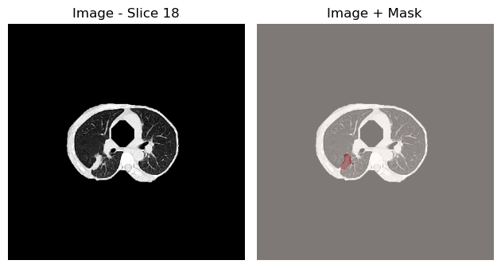

# Project-Lung-Cancer: Explainable AI for Lung Cancer Stage Classification

## Introduction
This project aims to develop and analyze machine learning models for lung cancer stage classification using Explainable AI (XAI) techniques. By implementing post hoc explanation methods, we gain insights into how our models make decisions, enhancing both model performance and clinical interpretability.

### Project Objectives
- Develop accurate classification models for lung cancer staging
- Apply post hoc XAI methods to understand model decision-making processes
- Create a framework for medical image analysis with transparent, interpretable results
- Advance skills in machine learning and explainable AI techniques

### Dataset
This project utilizes the Lung-PET-CT-Dx dataset:
> Li, P., Wang, S., Li, T., Lu, J., HuangFu, Y., & Wang, D. (2020). A Large-Scale CT and PET/CT Dataset for Lung Cancer Diagnosis (Lung-PET-CT-Dx) [Data set]. The Cancer Imaging Archive. https://doi.org/10.7937/TCIA.2020.NNC2-0461

The dataset includes CT and PET/CT scans from lung cancer patients with corresponding clinical information, providing a comprehensive basis for cancer staging analysis.

## Methodology
Our approach consists of two primary phases:

1. **Classification**: Developing models to classify patient data according to cancer stage
   - Data preprocessing and feature extraction
   - Model selection and optimization
   - Performance evaluation using clinical metrics

2. **Explainability**: Implementing post hoc XAI methods to understand model decisions
   - Feature importance analysis
   - Visual explanations of model predictions
   - Correlation between model features and clinical factors

## Installation and Setup

### Prerequisites
- Python 3.8+
- Create two separate environments for Data_preparation and Segmentation
- Environment for Data_preparation : download the packages listed in `requirements.txt`
- Environment for Segmentation : create a conda environment and download the packages listed in `requirements.sh`

### Getting Started
1. Clone this repository
```bash
git clone https://github.com/cons000000/project-lung-cancer.git
cd project-lung-cancer
```
2. Download the dataset in the [Data Access](https://www.cancerimagingarchive.net/collection/lung-pet-ct-dx/) section, both the files names "Images" and "Clinical Data" are needed.

## Data Access
The Lung-PET-CT-Dx dataset is available through The Cancer Imaging Archive (TCIA). To access the data:

1. Visit [TCIA's collection page](https://www.cancerimagingarchive.net/)
2. Create an account and accept the data usage agreement
3. Download the dataset using the NBIA Data Retriever tool
4. Place the downloaded data in the `NIH dataset_raw/` directory

## Repository Structure
```
project-lung-cancer/
├── NIH dataset_raw/                      
│   ├── manifest-1608669183333/           
│   ├── NRRD/                             
│   └── Processed/                        
├── src/
│   ├── Data_preparation/               
│   │   ├── readme.md                     
│   │   ├── requirements.sh              
│   │   ├── Segmentation.ipynb            
│   │   └── TheDuneAI.py                  
│   ├── T_Stage_Classification/         
│   │   ├── Auto RECIST and tumour volume measurements.ipynb
│   │   ├── combined_t_stage_recist.csv
│   │   ├── Readme.txt
│   │   ├── recist_and_volume_calculator.py
│   │   └── resultats_tumeurs.csv
│   ├── Visualize_lung_mask/             
│   │   ├── requirements.txt
│   │   └── visualize_data.ipynb
│   ├── Xai/                             
│   │   └── Grad_Cam.ipynb
│   ├── Segmentation/                     
│   │   ├── model_files/                  
│   │   ├── Generator_v1.py               
│   │   ├── lung_extraction_funcs_13_09.py
│   │   ├── Segmentation.ipynb
│   │   ├── TheDuneAI.py
│   │   └── visualize_data.ipynb
└── README.md                             

```

## Usage
1. **Data Preparation**: Run the data preparation notebook to process the raw CT and PET/CT scans
```bash
jupyter notebook src/Data_preparation/data_preparation.ipynb
```

2. **Segmentation**: Run the segmentation notebook to extract lung regions and identify tumors
```bash
jupyter notebook src/Segmentation/Segmentation.ipynb
```

## Results

1. **Analysis, presentation et exploration of the data** 

# Lung Cancer Dataset Summary

The information about the patients has two components: the TNM staging on the one hand and the hispotological grading on the other hand. Below is a short recap to understand the difference between these two.

| **Aspect**             | **TNM Staging**                          | **Histopathological Grading**              |
| ---------------------- | ---------------------------------------- | ------------------------------------------ |
| **Focus**              | Anatomical spread                        | Cellular appearance & behavior             |
| **Used for**           | Treatment decisions, prognosis           | Tumor aggressiveness, additional prognosis |
| **Components**         | T, N, M                                  | Differentiation (G1-G3)                    |
| **Depends on**         | Imaging, biopsies, surgery               | Microscopic examination                    |
| **More important for** | Surgical resectability, radiation fields | Chemotherapy response prediction           |

1.a) **TNM Staging**

The TNM staging system for lung cancer is used to describe the extent of cancer in a patient's body. It is based on three components:
- T (Tumor): Describes the size and extent of the primary tumor (T0 to T4, with higher numbers indicating larger or more invasive tumors).
- N (Nodes): Indicates the extent of regional lymph node involvement (N0 to N3, with higher numbers showing more extensive node involvement).
- M (Metastasis): Specifies whether cancer has spread to distant organs (M0 indicates no distant spread, M1 indicates metastasis).

## T-Stage Distribution

<figure>
  
  <figcaption><b>Chart 1:</b> T-Stage distribution</figcaption>
</figure>
<br>

There are also 3 patients whose T-stage is called "is".

According to this array, all patient have a tumor. It can however be small.

Here is how the classification is achieved given the size of the tumor.

| T-Stage | Tumor Size                   |
| ------- | ---------------------------- |
| T1a     | ≤ 1 cm (≤ 10 mm)             |
| T1b     | > 1 cm and ≤ 2 cm (11–20 mm) |
| T1c     | > 2 cm and ≤ 3 cm (21–30 mm) |
| T2a     | > 3 cm and ≤ 4 cm (31–40 mm) |
| T2b     | > 4 cm and ≤ 5 cm (41–50 mm) |
| T3      | > 5 cm and ≤ 7 cm (51–70 mm) |
| T4      | > 7 cm (> 70 mm)             |

## N-Stage Distribution

<figure>
  
  <figcaption><b>Chart 2:</b> N-Stage distribution</figcaption>
</figure>
<br>

## M-Stage Distribution

<figure>
  
  <figcaption><b>Chart 3:</b> M-Stage distribution</figcaption>
</figure>
<br>

1.b) **Histopathological Grading**

## Histopathological Grading

<figure>
  
  <figcaption><b>Chart 3:</b> Histopathological Grading</figcaption>
</figure>
<br>

# Explainability (using the Xplique library)

<figure>
  
  <figcaption><b>Image 1: </b>Model segmentation on the middle slice</figcaption>
</figure>
<br>

1. Saliency

<figure>
  
  <figcaption><b>Image 2: </b>Saliency explanation</figcaption>
</figure>
<br>

2. Integrated gradients 

<figure>
  
  <figcaption><b>Image 3: </b>Integrated gradients explanation</figcaption>
</figure>
<br>

3. Gradient input

<figure>
  
  <figcaption><b>Image 4: </b>Gradient input explanation</figcaption>
</figure>
<br>

4. Smooth grad
<figure>
  
  <figcaption><b>Image 5: </b>Smooth grad explanation</figcaption>
</figure>
<br>

5. Sobol Attribution Method
<figure>
  
  <figcaption><b>Image 6: </b>Sobol attribution method explanation</figcaption>
</figure>
<br>

6. Square grad
<figure>
  
  <figcaption><b>Image 7: </b>Square grad explanation</figcaption>
</figure>
<br>

7. Var grad
<figure>
  
  <figcaption><b>Image 8: </b>Var grad explanation</figcaption>
</figure>
<br>
