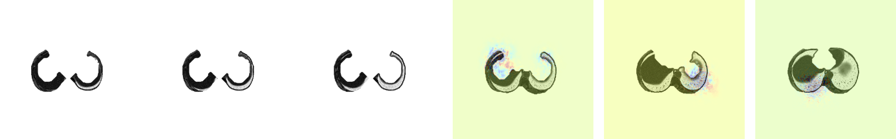

# Explainable AI for Lung Cancer Stage Classification

This project provides a comprehensive pipeline for applying, evaluating, and interpreting a pre-trained deep learning model for lung cancer stage classification. By leveraging post-hoc Explainable AI (XAI) techniques, we demystify the model's decision-making process, ensuring its predictions are not only accurate but also transparent, reliable, and clinically relevant.

## Table of Contents
- [Project Overview](#project-overview)
- [Key Features](#key-features)
- [Project Pipeline](#project-pipeline)
- [Repository Structure](#repository-structure)
- [Getting Started](#getting-started)
  - [Prerequisites](#prerequisites)
  - [Installation and Data Setup](#installation-and-data-setup)
- [Usage Guide](#usage-guide)
- [Data Exploration: The TNM Staging System](#data-exploration-the-tnm-staging-system)
- [Model implementation and analysis](#model-implementation-and-analysis)
  - [DuneAI for Segmentation](#duneai-for-segmentation)
  - [T-Stage Classification Logic](#t-stage-classification-logic)
  - [Explainable AI (XAI) Analysis](#explainable-ai-xai-analysis)
  - [Visualizing the Model’s Focus in 3D](#visualizing-the-model’s-focus-in-3d)
  - [Classification Performance](#classification-performance)
- [Limitations and Future Work](#limitations-and-future-work)
- [References](#references)

## Project Overview

Artificial intelligence has shown remarkable success in medical imaging, but the "black box" nature of many deep learning models remains a significant barrier to their adoption in clinical practice. This project tackles that challenge head-on. We create and document an end-to-end framework to analyze a pre-trained model for classifying lung cancer stages from CT and PET/CT scans.

Our core objectives are:
- **Apply** a state-of-the-art model to segment and classify lung cancer.
- **Explain** the model's predictions using a diverse suite of XAI methods to understand its internal logic.
- **Evaluate** the model's behavior and performance against established clinical standards (TNM staging).
- **Establish** a reproducible pipeline for the analysis and interpretation of medical imaging AI.

## Key Features
- **End-to-End Inference Pipeline:** A complete workflow from data ingestion and preprocessing to segmentation, prediction, and explanation.
- **State-of-the-Art Model Integration:** Utilizes the **DuneAI** model for tumor segmentation. An implementation for a second model (**UnSegMedGAT**) is included for future extension.
- **Deep Explainability:** Leverages a wide array of XAI techniques from the `Xplique` library for a holistic view of the model's decision-making process.
- **Clinically Grounded Analysis:** The entire analysis is framed around the **TNM staging system** to assess the model's practical utility and alignment with medical standards.

## Project Pipeline

Our methodology is an inference and analysis pipeline designed to scrutinize a pre-trained model's behavior.

**`Data Acquisition`** → **`Preprocessing & Segmentation`** → **`Prediction (Inference)`** → **`Explainability Analysis`**

## Repository Structure
```
project-lung-cancer/
├── NIH dataset_raw/              # Raw TCIA dataset (images and clinical data)
├── Data-analysis/                # Jupyter notebooks for initial data exploration
├── Figures/                      # All plots and visualizations generated for the README
├── Model_1/                      # Primary model (DuneAI)
│   ├── Data_preparation/         # Scripts for converting DICOM to NRRD
│   ├── Segmentation/             # Scripts for running tumor segmentation
│   ├── T_Stage_Classification/   # Scripts for classifying T-stage from segmentations
│   └── Xai/                      # Scripts for generating XAI attribution maps
├── Model_2 (weights lacking)/    # Secondary model (UnSegMedGAT, weights unavailable)
├── Visualize_lung_mask/          # Utility scripts for visualization
└── README.md
```

## Getting Started

### Prerequisites
- Python 3.8+
- Conda (`Miniconda` or `Anaconda`)
- A GPU (necessary for the segmentation but not the data analysis)

### Installation and Data Setup

**Step 1: Clone the Repository**
```bash
git clone https://github.com/cons000000/project-lung-cancer.git
cd project-lung-cancer
```

**Step 2: Set Up Conda Environments**
Different environments are required due to dependency constraints.

#### Data-analysis :

```bash
# 1. Environment for Data Preparation
conda create --name analysis_env python=3.8 -y
conda activate analysis_env
pip install -r Data-analysis/requirements.txt
```

#### Model_1 :

```bash
# 1. Environment for Data Preparation
conda create --name dataprep python=3.8 -y
conda activate dataprep
pip install -r Model_1/requirements_data_prep.txt
```

```bash
# 2. Environment for Segmentation, T_Stage_Classification & XAI
sbatch Model_1/Segmentation/requirements_seg.slurm
```

**Step 3: Download the Dataset**
This project uses the **Lung-PET-CT-Dx** dataset from The Cancer Imaging Archive (TCIA).

1.  Navigate to the [TCIA Data Access Page](https://www.cancerimagingarchive.net/collection/lung-pet-ct-dx/) and accept the data usage policy.
2.  **Download Clinical Data:** Download the "Clinical Data" spreadsheet directly from the page.
3.  **Download Image Data:**
    *   Image data must be downloaded using the **NBIA Data Retriever**. [Install it from the TCIA Wiki](https://wiki.cancerimagingarchive.net/display/NBIA/Downloading+TCIA+Images#DownloadingTCIAImages-DownloadingtheNBIADataRetriever).
    *   On the TCIA page, add the image collection to your cart, and download the manifest file (`.tcia`).
    *   Open the NBIA Data Retriever, load the manifest file, and begin the download.
4.  **Organize Files:** Create a directory named `NIH dataset_raw/` at the project root. Place the downloaded clinical data file and the folder of patient images inside it.

## Usage Guide
Follow the notebooks in sequence, ensuring you activate the correct Conda environment for each stage.

1.  **Data Preparation (`conda activate lung-dataprep`)**
    - Run the notebooks in `Model_1/Data_preparation/` to process the raw DICOM files into the NRRD format required by the model.
2.  **Segmentation and Analysis (`conda activate lung-segment`)**
    - Run the notebook in `Model_1/Segmentation/` to perform tumor segmentation on the NRRD files using the DuneAI model.
    - Proceed to `Model_1/T_Stage_Classification/` to classify the T-stage based on the segmentation output.
    - Finally, run the notebooks in `Model_1/Xai/` to generate and visualize the explainability maps.

## Data Exploration: The TNM Staging System

Our analysis is grounded in the clinical **TNM Staging System**, the global standard for classifying the anatomical extent of cancer.

| Aspect         | TNM Staging                                 | Histopathological Grading          |
| :------------- | :------------------------------------------ | :--------------------------------- |
| **Focus**      | Anatomical spread of the tumor              | Cellular appearance & aggressiveness |
| **Components** | **T** (Tumor size), **N** (Nodes), **M** (Metastasis) | Differentiation (Grade G1-G3)      |

The **Lung-PET-CT-Dx** dataset provides labels for T, N, and M stages. The distribution of these labels is shown below.

<p align="center">
  
  
  
</p>
<p align="center">
  <b>Figure 1:</b> Distribution of ground truth labels for T-Stage, N-Stage, and M-Stage in the dataset.
</p>

Here are the labels generally used in radiology to caracteristize each of these stages. There is no mention of M2 or M3 as one can see (M-Stage). Regarding the N-Stage, it requires not only to identify a tumor but also to look if it has eventually metastasized and where. Given the complexity of this task, the present project is focusing on finding the true T-Stage.

| T (Tumor)            | N (Nodes)               | M (Metastasis)          |
|----------------------|-------------------------|-------------------------|
| **is**: In situ     | **N0**: No nodes        | **M0**: No metastasis   |
| **T1** ≤3 cm         | **N1**: Ipsilateral hilar | **M1**: Distant        |
| ・T1a ≤1 cm          | **N2**: Mediastinal     | ・M1a: Contralateral lung |
| ・T1b >1-2 cm        | **N3**: Contralateral   | ・M1b: Single distant   |
| ・T1c >2-3 cm        |                         | ・M1c: Multiple distant |
| **T2** >3-5 cm       |                         |                         |
| ・T2a >3-4 cm        |                         |                         |
| ・T2b >4-5 cm        |                         |                         |
| **T3** >5-7 cm       |                         |                         |
| **T4** >7 cm         |                         |                         |


## Model implementation and analysis

### DuneAI for Segmentation
**DuneAI** is a deep learning model designed for the automated detection and segmentation of non-small cell lung cancer (NSCLC) in CT images. We use the **[precision-medicine-toolbox](https://github.com/primakov/precision-medicine-toolbox)** for data preprocessing.

- **Preprocessing:** DICOM images are converted to NRRD using the precision medicine toolbox.
- **Input Format:** NRRD files.

### T-Stage Classification Logic
The model first segments the tumor and outputs a mask. 

We then calculate the size of the mask to give the tumor size. Ultimatly it is mapped to a clinical T-stage according to established guidelines.

**Table 1: Mapping Tumor Size to T-Stage**
| T-Stage | Tumor Size                   |
| :------ | :--------------------------- |
| T1a     | ≤ 1 cm (≤ 10 mm)             |
| T1b     | > 1 cm and ≤ 2 cm (11–20 mm) |
| T1c     | > 2 cm and ≤ 3 cm (21–30 mm) |
| T2a     | > 3 cm and ≤ 4 cm (31–40 mm) |
| T2b     | > 4 cm and ≤ 5 cm (41–50 mm) |
| T3      | > 5 cm and ≤ 7 cm (51–70 mm) |
| T4      | > 7 cm (> 70 mm)             |

*Note: The ground truth dataset contains a mix of general labels (e.g., 'T2') and specific sub-stages (e.g., 'T2a'). This label granularity mismatch is a key challenge addressed in the performance analysis.*

### Explainable AI (XAI) Analysis

Just below is the data for one patient and the segmentation's result after using DuneAI.

<p align="center">
  
  <br>
  <b>Figure 2:</b> Original CT for one patient. The 3D image is a sequence of 36 slices.
</p>

<p align="center">
  
  <br>
  <b>Figure 3:</b> Example of DuneAI segmentation results showing the original image overlayed with the predicted mask.
</p>

To truly trust a model, we must understand *how* it arrives at its conclusions. Since the model analyzes the CT scan slice by slice, we can apply XAI methods to each slice to create a sequence of attribution maps. This approach provides a pseudo-3D, volumetric understanding of the model's decision-making process, allowing us to see how its focus evolves across the depth of the tumor.

**Figure 4: Volumetric XAI Attribution Maps**
*The table below visualizes the model's focus across all slices of a patient's scan for different XAI methods.*

| Method | Visualization | Description |
| :--- | :--- | :--- |
| **Saliency Map** | <div style="display:flex; flex-direction:column">       </div> | **Raw pixel influence.** Shows the gradient of the output with respect to the input pixels. It's fast but can be noisy. |
| **Gradient × Input** | <div style="display:flex; flex-direction:column">       </div> | **Influence combined with pixel intensity.** Weights the gradients by the input pixel values, highlighting influential bright/dark areas. |
| **Integrated Gradients** | <div style="display:flex; flex-direction:column">       </div> | **Stable, cumulative pixel importance.** Aggregates gradients along a path from a baseline (black) image to the input, providing more robust and less noisy attributions. |
| **SmoothGrad** | <div style="display:flex; flex-direction:column">       </div> | **Noise-reduced explanation.** Averages saliency maps over multiple noisy copies of the input to produce a cleaner, more stable visualization. |
| **SquareGrad** | <div style="display:flex; flex-direction:column">       </div> | **Magnitude of influence.** Similar to SmoothGrad, but focuses on the magnitude of gradients, highlighting impactful regions regardless of positive/negative influence. |
| **VarGrad** | <div style="display:flex; flex-direction:column">       </div> | **Stability/uncertainty of model focus.** Measures the variance of gradients. Bright areas indicate regions where the model's focus is unstable or uncertain. |
| **Sobol Attribution** | <div style="display:flex; flex-direction:column">       </div> | **Importance including feature interactions.** A sophisticated method that captures not just individual pixel importance but also the contribution of interactions between pixels. |

### Classification Performance

This study compares two different T-stage classification methods to evaluate their effectiveness in predicting cancer stages:

1. **RECIST Method:** The original implementation that calculates tumor diameter using the RECIST (Response Evaluation Criteria in Solid Tumors) guidelines, measuring the longest diameter of the tumor.

2. **Ellipsoid Method:** An alternative approach that models the tumor as an ellipsoid and calculates an equivalent spherical diameter based on the tumor's volume, providing a more comprehensive representation of tumor size.

Both methods were evaluated using the same dataset and classification criteria to ensure fair comparison.

#### RECIST Method Performance

The RECIST method's T-stage classification performance was evaluated using a confusion matrix, highlighting the model's strengths and weaknesses in distinguishing between different cancer stages.

<p align="center">
  
</p>
<p align="center">
  <b>Figure 5a:</b> Confusion Matrix for RECIST method showing model-predicted T-stages versus the actual T-stages from the dataset.
</p>

**Analysis of RECIST Classification Performance:**

- **Strongest Performance:** The RECIST method shows its highest confidence and accuracy in identifying the **T1c** stage, correctly classifying 24 cases.
- **Adjacent Stage Confusion:** A common pattern is the confusion between adjacent or near-adjacent stages, which is clinically understandable as it depends on precise size measurements. For example, actual **T1c** cases are frequently misclassified as **T1b** (13 cases) or **T2a** (20 cases). This indicates the model is identifying tumors of a similar size but the calculated diameter falls just across a classification boundary.
- **Handling of General vs. Specific Labels:** The ground truth contains general labels like '2' and '3', while the model predicts specific sub-stages. The RECIST method tends to overestimate the stage for these general labels; for example, actual **T2** cases are most often predicted as **T2b** (10), **T3** (16), or even **T4** (6). This highlights a challenge in reconciling different levels of label granularity.
- **Challenges with Smallest Tumors:** The RECIST method struggles significantly with the smallest tumors, failing to correctly identify any **T1a** cases, often classifying them as larger stages like **T1b** or **T1c**.

#### Ellipsoid Method Performance

The ellipsoid method's performance was similarly evaluated to provide a direct comparison with the RECIST approach.

<p align="center">
  
</p>
<p align="center">
  <b>Figure 5b:</b> Confusion Matrix for Ellipsoid method showing model-predicted T-stages versus the actual T-stages from the dataset.
</p>

**Analysis of Ellipsoid Classification Performance:**

- **Enhanced Volume-Based Assessment:** The ellipsoid method provides a more comprehensive tumor size assessment by considering the three-dimensional characteristics of the tumor rather than just the longest diameter.
- **Stage Distribution Patterns:** [Analysis will be added based on the actual ellipsoid confusion matrix results]
- **Comparison with RECIST:** [Specific differences in classification patterns will be noted here]

#### Comparative Method Analysis

A comprehensive comparison between both methods reveals their relative strengths and performance characteristics.

<p align="center">
  
</p>
<p align="center">
  <b>Figure 6:</b> Comprehensive comparison between RECIST and Ellipsoid methods showing (left) accuracy comparison, (middle) mean stage error comparison, and (right) error distribution by T-stage.
</p>

**Key Findings from Method Comparison:**

- **Overall Accuracy:** The Ellipsoid method achieves 34.90% accuracy compared to RECIST's 32.29%, representing a 2.60% improvement in classification performance.
- **Error Patterns:** The Ellipsoid method shows consistently lower mean stage errors across most T-stages, with the most significant improvements in T1b (0.166 reduction) and T2b (0.250 reduction) classifications.
- **Stage-Specific Performance:** Both methods perform best on T3 and T4 stages (lowest mean errors of 0.52-0.60 and 0.40 respectively), while struggling most with T1a stages (2.80 mean error) and the rare 'is' (in situ) cases.
- **Clinical Implications:** The Ellipsoid method's volume-based approach provides more accurate tumor size assessment, particularly beneficial for borderline cases between T-stages where precise measurement is critical.

**Performance Summary:**

| Metric | RECIST Method | Ellipsoid Method | Better Method |
|--------|---------------|------------------|---------------|
| Overall Accuracy | 32.29% | 34.90% | **Ellipsoid** |
| Mean Stage Error | 1.193 | 1.125 | **Ellipsoid** |
| Error Rate | 67.71% | 65.10% | **Ellipsoid** |
| T1b Mean Error | 1.083 | 0.917 | **Ellipsoid** |
| T1c Mean Error | 1.173 | 1.136 | **Ellipsoid** |
| T2b Mean Error | 1.125 | 0.875 | **Ellipsoid** |
| Standard Deviation | 1.197 | 1.200 | RECIST (slightly) |


## Limitations and Future Work

### Known Issues
- **Limited Model Comparison:** The analysis was restricted to **DuneAI**, as pre-trained weights for the alternative model (**UnSegMedGAT**) were not publicly available.
- **Dataset Imperfections:** A subset of image files in the public dataset were found to be corrupted or missing essential `z-spacing` metadata, requiring data cleaning and exclusion.
- **2D Slice-Based Analysis:** While our XAI analysis provides a pseudo-3D view, the model itself still operates on 2D slices, which may not fully capture complex 3D volumetric context.

### Future Work
- **Comparative Model Analysis:** Acquire weights for `Model_2` (UnSegMedGAT) to enable a direct performance and explainability comparison between different architectures.
- **True 3D Explainability:** Implement XAI methods designed specifically for 3D convolutional networks to generate a true 3D attribution map, moving beyond the slice-by-slice approximation.
- **Expand Model Repository:** Survey recent literature to identify and integrate other publicly available pre-trained models for a broader comparative study.

## References

#### Dataset
> Li, P., Wang, S., Li, T., Lu, J., HuangFu, Y., & Wang, D. (2020). *A Large-Scale CT and PET/CT Dataset for Lung Cancer Diagnosis (Lung-PET-CT-Dx) [Data set]*. The Cancer Imaging Archive. [https://doi.org/10.7937/TCIA.2020.NNC2-0461](https://doi.org/10.7937/TCIA.2020.NNC2-0461)

#### Models and Toolboxes
> Primakov, S. P., Ibrahim, A., van Timmeren, J. E., et al. (2022). Automated detection and segmentation of non-small cell lung cancer computed tomography images. *Nature Communications, 13*(1), 3423. [https://doi.org/10.1038/s41467-022-30841-3](https://doi.org/10.1038/s41467-022-30841-3)

> Primakov, S., Lavrova, E., Salahuddin, Z., Woodruff, H. C., & Lambin, P. (2022). *Precision-medicine-toolbox: An open-source python package for facilitation of quantitative medical imaging and radiomics analysis*. arXiv preprint arXiv:2202.13965. [https://arxiv.org/abs/2202.13965](https://arxiv.org/abs/2202.13965)

> Fel, T., Hervier, L., Vigouroux, D., et al. (2022). *Xplique: A Deep Learning Explainability Toolbox*. Workshop on Explainable Artificial Intelligence for Computer Vision (CVPR). [https://arxiv.org/abs/2204.13132](https://arxiv.org/abs/2204.13132)

#### Related Literature
> Ma, J., He, Y., Li, F., et al. (2024). Segment anything in medical images. *Nature Communications, 15*(1), 654. [https://doi.org/10.1038/s41467-024-44824-z](https://doi.org/10.1038/s41467-024-44824-z)